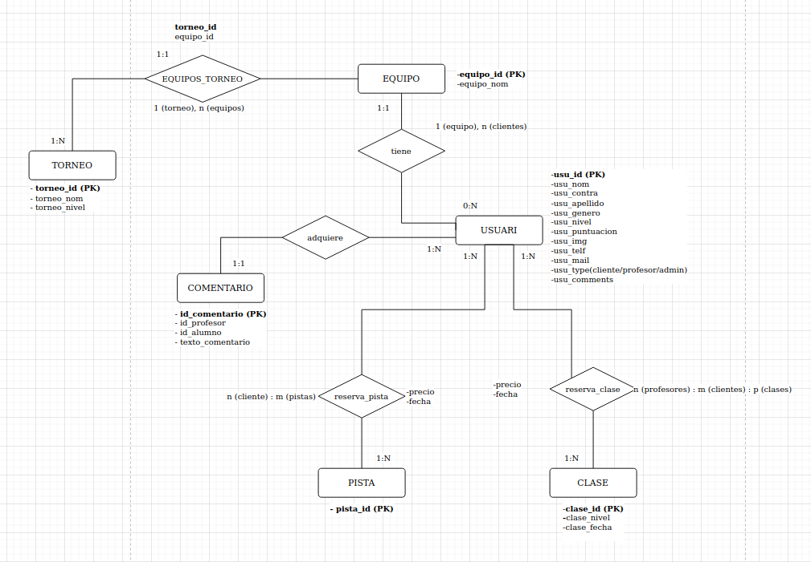

# GOPADEL
Proyecto grupal (Hugo, Arnau, Alex) basado en una web de **padel**, ambientada para negocios o franquicias de **padel**, que quieran escalar su negocio con nuestros métodos y funciones que permiten dar al que adquiere nuestro producto un manejo total y completo en todo momento de su nuevo negocio.

## ÍNDICE
* [Introducción](#introducción)
* [Bases Proyecto](#bases-proyecto)
  * [Diagrama de Arquitectura](#diagrama-de-arquitectura)
  * [Diagrama del Modelo Entidad Relación](#diagrama-del-modelo-entidad-relación)
  * [Diagrama Casos de Uso](#diagrama-casos-de-uso)
  * [Guía Estilo](#guía-estilo)
* [Funcionalidades](#funcionalidades)

## INTRODUCCIÓN
Este proyecto, parte de un trabajo final, el cual se ha realizado en el instituto en horas de clase, en grupos. Decidimos elegir uno de los temas sugeridos por los profesores porque nos pareció muy interesante.
Esta basado en la gestion de un **club de padel** y contiene diversos servicios, especialmente, creados para poder hacer crecer el negocio, ya que es lo importante, cuando vendes un producto de cara a un cliente
lo que buscan es potenciar sus negocios para poder generar dinero.

## BASES PROYECTO

### Diagrama de Arquitectura

### Diagrama del Modelo Entidad Relación

### Diagrama Casos de Uso

### Guía Estilo

### No logueado
Con este tier puedes ver las páginas principales de la web. Puedes ver la página principal `index.php`, en la cual hay información sobre la propia página, `ranking.php`, donde podrás ver los 10 usuarios registrados con MÁS puntuación, los profesores disponibles que dan clase (aunque no podrás reservar) e información sobre estos. Por último, los formularios de `login.php`, para iniciar sesión si ya tienes cuenta, y `register.php` para registrarte si no tienes una cuenta ya creada.

### User
El tier de usuario logueado más bajo. Con este usuario puedes hacer todo lo que el usuario no logueado. Aparte de esto, tienes acceso a las reservas. Puedes reservar pistas por separado o apuntarte a clases para participar en estas con diferentes alumnos en una misma pista. Además, puedes hacer equipo y participar en torneos a Dúos haciendo equipo con otros miembros. Al ganar torneos consigues puntos. Cuantos más puntos tengas, más alto estarás en el ranking de la página. Con esto, si estás entre los 15 usuarios con más puntos, ¡aparecerás en una tabla de puntuación en una página a parte!

### Profesor
El tier de profesor puede, como el anterior, hacer los que están por debajo de él. Además, un profesor puede poner comentarios en los alumnos. Profesor es un nivel de usuario intermedio, no puede hacer mucho más que un usuario normal, pero sirve para distinguir a los profesionales que enseñan al resto. Este nivel se ve en una página a parte llamada `profesores.php`.

### Admin
El tier de administrador sirve, de nuevo, para hacer y participar en el resto de cosas por debajo del suyo. El rol de un administrador es moderar entre usuarios. Pueden gestionar reservas que no son suyas, pueden eliminar usuarios, modificar y crearlos. También puede poner comentarios en la ficha de usuario de otros usuarios. No aparece en ninguna página como `profesores.php` ni tampoco se le da un trato especial en `ranking.php`. Puede crear otros administradores, profesores y usuarios.

### Funcionalidades principales
Como se ha explicado anteriormente en los niveles de usuario, hay varias funcionalidades grandes. Las que creemos que son más importantes son:

#### Inicio de sesión y Registro
Esta página web goza de una base de datos en la cual se guardan diferentes datos de usuario y, de manera cifrada, una contraseña. A partir de estos datos, se crea y actualiza constantemente una tabla de ranking con los diferentes usuarios ordenada a partir de la puntuación que se consigue participando en torneos de padel organizados por los mismos usuarios.

#### Reserva de pistas y clases
Como ya hemos comentado, puede reservarse 1 de las 12 pistas disponibles, aunque dos de ellas están dedicadas a clases, en franjas de tiempo de dos horas. El sitio está abierto de 8 de la mañana (08:00 am) a 8 de la tarde (20:30 pm), 12 horas y media. Puedes reservar pistas de 8 a 10, de 10 a 12, de 12 a 14, de 14 a 16, de 16 a 18 y de 18 a 20. Las pistas 11 y 12 están reservadas para realizar clases privadas de profesores con alumnos.

#### Inscripción y creación de Torneos
Esta funcionalidad permite a los administradores crear torneos. Los torneos son de hasta 8 equipos. A partir de aquí, hay 3 pantallas donde se desarrollan los torneos. En la primera están los 8 equipos emparejados. Hay unos botones al lado de cada partido para elegir qué equipo ha sido el vencedor. Los datos del equipo vencedor se guardan, y en el momento de pasar a la siguiente fase, se borran los equipos que han perdido. Así durante 3 rondas. 8 equipos y 4 partidos, 4 equipos y 2 partidos, y la final. Después de estas 3 pantallas acabas en la pantalla de Ganadores, en la cual sale el nombre del equipo de los vencedores y los miembros que lo componen. Solamente los ganadores consiguen 150 puntos al ganar un torneo.
